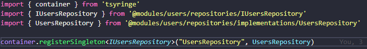

</img>
<h1 align="center">Teste para empresa NEAR Location</h1>

Acesso para API em Produção: <a href="http://54.90.95.139/users/name"> http://54.90.95.139/users/name-example </a>  

Documentação no Swagger: <a href="http://54.90.95.139/api-docs/">http://54.90.95.139/api-docs/</a>   

<h1 align="center">
    🔗 Github API
</h1>

🚀 API Rest para listar por nomes os usuários do Github

<h1>Arquitetura</h1>
<h2>Clean Arquitecture com DDD e SOLID</h2>

<h4>
    
Cada Dominio tem seu próprio Módulo, com sua respectiva Entidade. Assim como os Repositórios, que segue com sua Interface e a Implementação da mesma, fazendo assim a <strong>Inversão de Dependência</strong>, quem deseja usar o repositório deve obrigatóriamente utilizar sua Interface.

    
Cada Módulo tem seu UseCase, separado em diretórios lidando com apenas uma função bem descrita já no seu nome de arquivo. Cada useCase acompanha seu Controller e respectivos Testes Unitários.

</h4>
<h1>Design Patterns</h1>
<h2>Singleton</h2>

<h4>Para <strong>Injeção de Dependências</strong> - foi utilizado a biblioteca TSYRINGE que ajuda a fazer injeção de dependências de uma forma mais simples, deixando o código menos verboso e concentrando as injeções de dependência em um único arquivo (se preferir).</h4>
<h1>Packages</h1>
<h4>
<ul>
<li>Axios - Comunicação com a API do Github</li>
<li>Express - Gerenciamento de rotas</li>
<li>Express-Async-Errors - Tratamento de Erros Assíncronos</li>
<li>Rate-limiter-flexible - Segurança de rotas, limitador de requisições por segundo.</li>
<li>Docker - Container contendo o Redis necessário para segurança das rotas, item citado acima.</li>
<li>Redis - Banco de dados de chave e valor.</li>
<li>Swagger - Documentação da API e utilização da mesma.</li>
<li>Tsconfig-paths - Utilizando de shorts paths menos verbosos como @module, @repositories, etc.</li>
<li>Tsyringe - Injeção de Dependências</li>
<li>Sentry - Monitoramento de erros do App em Produção</li>
<li>Babel - Para buildar o APP de forma mais rápida em comparação com o TSC.</li>
<li>Jest - Testes de funções </li>
<li>Ts-node-dev - Rodar o app localmente para utilização do Typescript</li>
<li>PM2 - Gerenciamento do APP em Produção. *Instalado apenas no EC2 em Produção.</li>
</ul>
</h4>

<h1>Instruções de build</h1>
<ul>
 <li>1- Após clonar o projeto</li>
 <li>2 - Instalar as dependencias: yarn ou npm install</li>
 <li>3 - Já com o docker instalado rodar o comando: docker-compose up -d</li>
 <li>4 - Criar o arquivo .env como no exemplo do arquivo .env.example * Algumas variaveis já foram preenchidas aidna no arquivo .env.example apenas para avaliação do teste. (tenho ciência que não pode).</li> 
</ul>
<h1>Cloud Computing</h1>
<h2>Amazon AWS</h2>
<h4>O app foi hospedado na AWS para demonstração de conhecimentos na nuvem.</h4>
<h4>Link para acesso: <a href="http://54.90.95.139/users/name"> http://54.90.95.139/users/name-example </a></h4>
<h4>Link para teste através do Swagger: <a href="http://54.90.95.139/api-docs/">http://54.90.95.139/api-docs/</a></h4>
<h1>CI / CD</h1>
<h2>Github Actions</h2>
<h4>Também foi feito a CI pelo próprio Github Actions para demonstração de Integração Contínua, no caso, quando é feito o push na branch Master. No EC2 também está sendo feito a <strong>gerência do App com o PM2.</strong></h4>
<h4>Arquivo main.yml para checagem: <a href="https://github.com/lukasdevelop/near-test/blob/master/.github/workflows/main.yml">main.yml</a></h4>

<h4>🚀Muito obrigado pela oportunidade. Teste teste.🚀</h4>
<h4>Autor: Lucas Amaral</h4>
<h4>Email: analista.sistemas.lucas@gmail.com</h4>